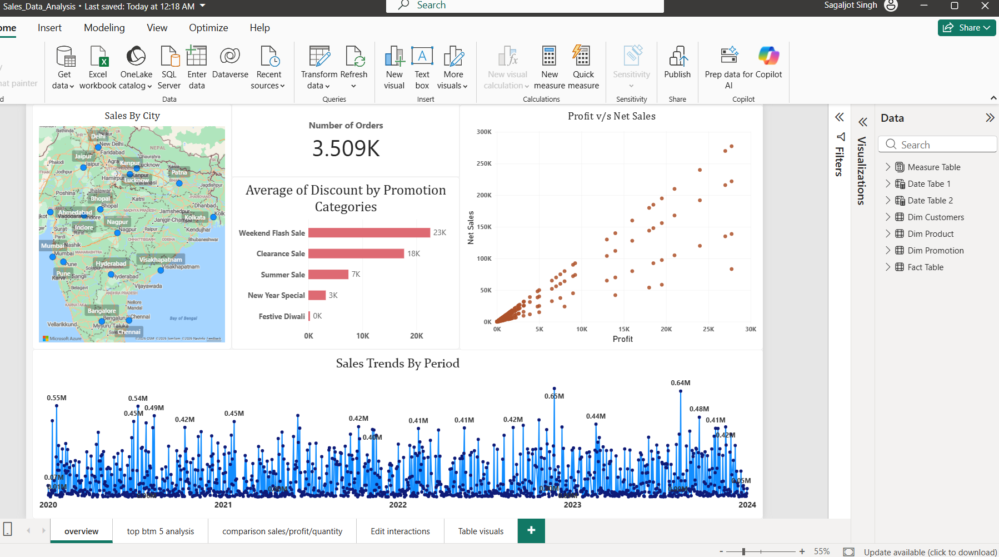
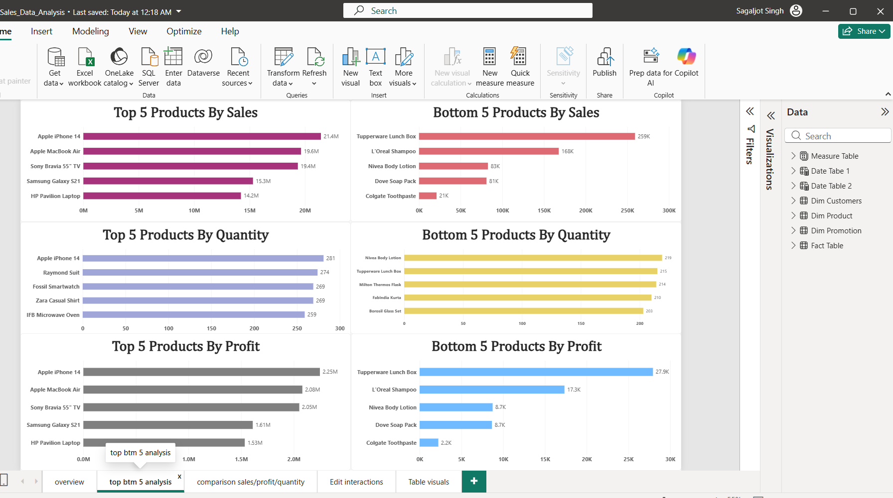
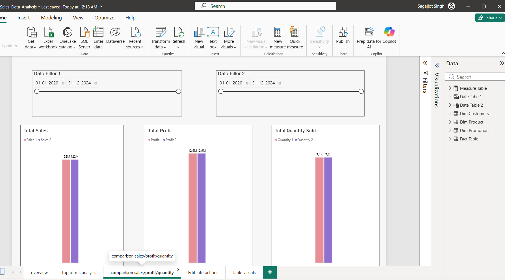
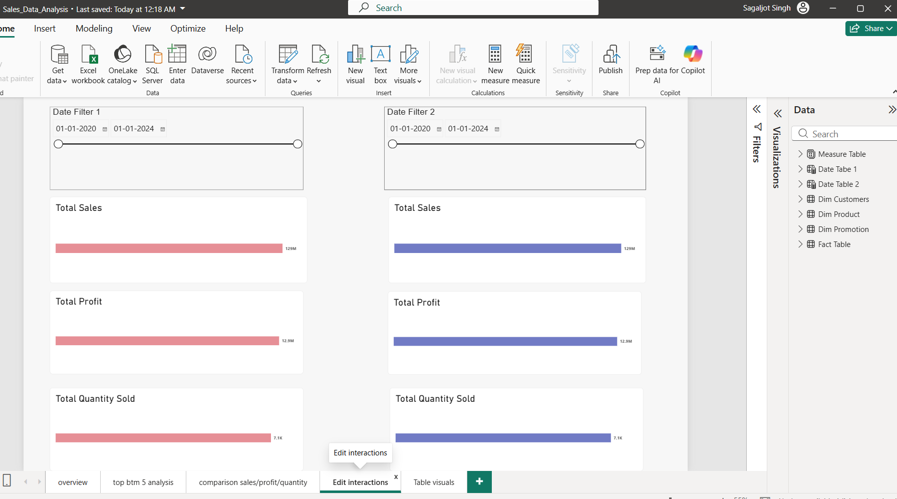
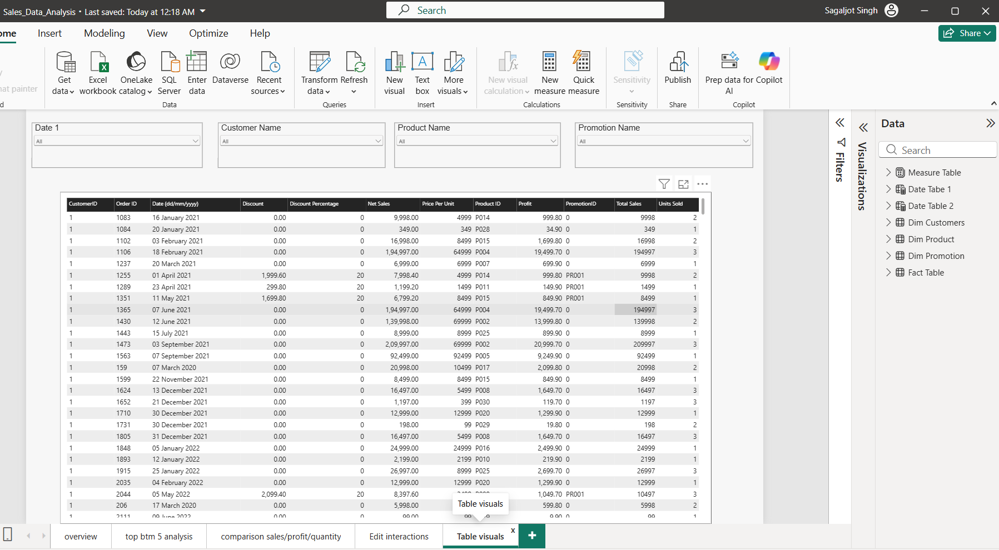

# Sales Data Analysis – Power BI

## Project Overview

This project is an interactive Sales Data Analysis dashboard developed using
Microsoft Power BI.

The report analyzes sales performance across products, customers, promotions,
cities, dates, quantities, discounts, and profitability.

## Objectives

- Analyze overall sales performance
- Identify Top 5 and Bottom 5 products
- Analyze products based on Sales, Profit, and Quantity Sold
- Analyze sales trends over time
- Analyze the relationship between Sales and Profit
- Compare Sales, Profit, and Quantity Sold between selected periods
- Analyze discounts and promotions
- Calculate and analyze total orders
- Analyze sales across different cities
- Provide detailed order-level information
- Enable interactive filtering using slicers

## Tools Used

- Microsoft Power BI
- Power Query
- DAX

## Dataset

The project uses a sales dataset containing information related to:

- Customers
- Products
- Promotions
- Orders
- Sales
- Profit
- Quantity Sold
- Discounts
- Prices
- Dates
- Cities

### Main Data Components

The Power BI model contains dimensional tables such as:

- **Dim Customers**
- **Dim Product**
- **Dim Promotion**

along with a main **Fact Table** containing transaction-level sales information.

## Data Analysis Performed

### Sales Analysis

The dashboard analyzes:

- Net Sales
- Total Sales
- Profit
- Quantity Sold
- Discounts
- Price Per Unit
- Orders

### Product Analysis

Products are analyzed based on:

- Sales
- Profit
- Quantity Sold
- Top 5 products
- Bottom 5 products

### Customer Analysis

Customer-level information is used to analyze:

- Customer names
- Customer IDs
- Order activity
- Sales performance

### Promotion Analysis

Promotion data is used to analyze:

- Promotion names
- Discount values
- Average discount
- Promotion-wise performance

### Geographic Analysis

Sales data is analyzed across different cities using geographic visualization.

---

# Report Pages

## Page 1 – Overview

The Overview page provides a high-level view of the sales data.

### Key Visuals

- City-wise geographic analysis
- Promotion-wise discount analysis
- Sales vs Profit analysis
- Sales trend over time
- Order information

### Dashboard Screenshot

### Key Features

- Geographic sales analysis
- Promotion and discount analysis
- Sales and profit relationship
- Time-based sales analysis
- Order analysis

---

## Page 2 – Top & Bottom 5 Analysis

This page focuses on identifying the Top 5 and Bottom 5 products.

### Analysis Includes

- Top 5 products by Quantity Sold
- Bottom 5 products by Quantity Sold
- Top 5 products by Net Sales
- Bottom 5 products by Net Sales
- Top 5 products by Profit
- Bottom 5 products by Profit

### Dashboard Screenshot

### Key Features

- Product ranking
- Sales comparison
- Profit comparison
- Quantity comparison
- Top and Bottom product analysis

---

## Page 3 – Sales, Profit & Quantity Comparison

This page compares business performance between selected periods.

### Metrics Compared

- Profit
- Net Sales
- Quantity Sold

The page includes date slicers that allow users to select different periods
and compare their performance.

### Dashboard Screenshot

### Key Features

- Period comparison
- Profit comparison
- Net sales comparison
- Quantity sold comparison
- Interactive date slicers

---

## Page 4 – Interactive Visual Analysis

This page demonstrates interactive visual analysis using slicers and
visual interactions.

### Analysis Includes

- Profit analysis
- Quantity Sold analysis
- Total Sales analysis
- Product-level analysis
- Interactive date filtering

### Dashboard Screenshot

### Key Features

- Interactive slicers
- Visual interactions
- Cross-filtering
- Product analysis
- Sales analysis
- Profit analysis

---

## Page 5 – Detailed Table Analysis

This page provides detailed order-level information.

### Information Included

- Customer ID
- Order ID
- Order Date
- Discount
- Discount Percentage
- Net Sales
- Price Per Unit
- Product ID
- Profit
- Promotion ID
- Total Sales
- Units Sold

### Available Filters

- Date
- Customer Name
- Product Name
- Promotion Name

### Dashboard Screenshot

### Key Features

- Detailed transaction information
- Customer filtering
- Product filtering
- Promotion filtering
- Date filtering
- Order-level analysis

---

# Key Features

### Interactive Slicers

Slicers allow users to dynamically filter the report and analyze specific
customers, products, promotions, and dates.

### Top/Bottom Product Analysis

The report identifies the highest and lowest performing products based on:

- Sales
- Profit
- Quantity Sold

### Time-Based Analysis

Sales and other metrics can be analyzed across different dates and periods.

### Sales & Profit Analysis

The dashboard provides comparisons between sales and profit to understand
business performance.

### Discount Analysis

Promotions and discounts are analyzed to understand their relationship with
sales performance.

### Geographic Analysis

City-level information is visualized to understand sales distribution across
locations.

### Detailed Order Analysis

The table page provides transaction-level information that can be filtered
using multiple slicers.

## Power BI Skills Demonstrated

- Data loading
- Data cleaning using Power Query
- Data modeling
- Relationships between tables
- DAX calculations
- Interactive slicers
- Data visualization
- Geographic visualization
- Top/Bottom analysis
- Time-based analysis
- Period comparison
- Cross-filtering
- Visual interactions
- Dashboard design
- Report-level analysis

## Dataset

The dataset was provided as part of the Udemy course
"Complete Data Analyst Bootcamp From Basics To Advanced"
by Krish Naik and Jayant Topnani.

The original course dataset is not redistributed in this repository.

## Project Type

Guided Power BI project completed as part of my Data Analyst training.
